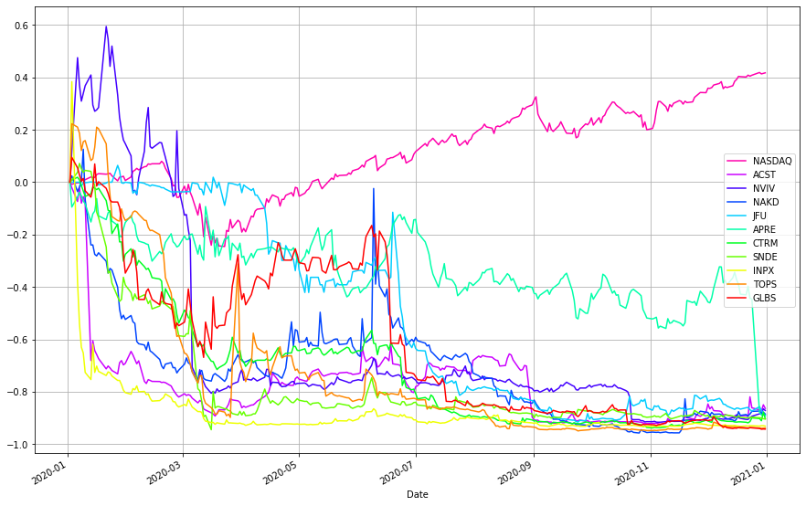
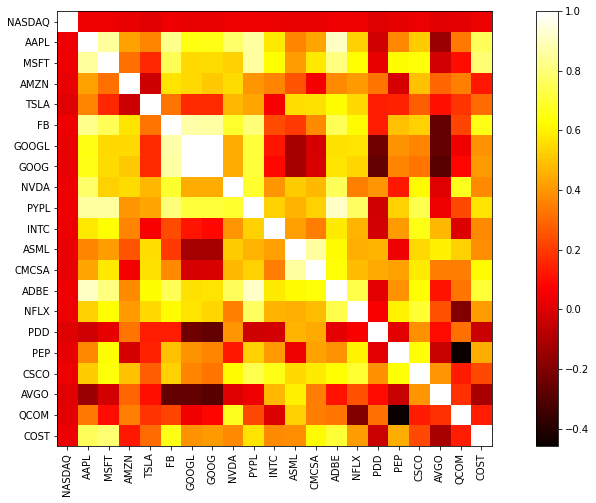
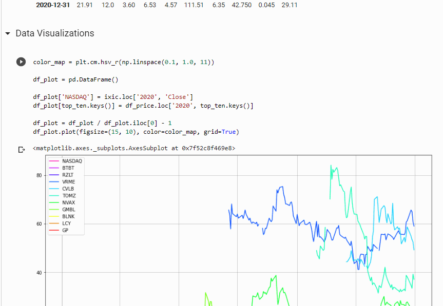

# nasdaq-analysis

  

## Description

Nasdaq-analysis is a jupyter notebook that explores, visualizes, and analyzes the Nasdaq Composite with various other stock items in the market. Firstly, I used the FinanceDataReader package to conveniently scrape stock market data and pandas module to efficiently construct them into data frames. The dataset was quite huge with over 3,328 companies listed (some were pruned after the data preprocessing process). I thought it would be interesting to calculate companies that had the best and worst returns in the year of 2020 because the coronavirus epidemic has significantly affected markets all over the world. I also took time to investigate potential correlations among the stocks to see if there were any interesting patterns. In addition, to process large sets of data points efficiently, I decided to use Google Colab, which allowed me to utilize its GPUs and memory space.

The general process for the notebook was:

1. Import all necessary packages
2. Attain stock market dataset from FinanceDataReader
3. Data Exploration and Visualizations
4. Data Preprocessing
5. Data Analysis
6. Returns
7. Correlations

## Usage

Every detailed step was recorded in the notebook and can easily be followed there.

## Figures and Charts

Data visualization of companies that had the worst returns.

Data visualization of stock correlations

Model Prediction

